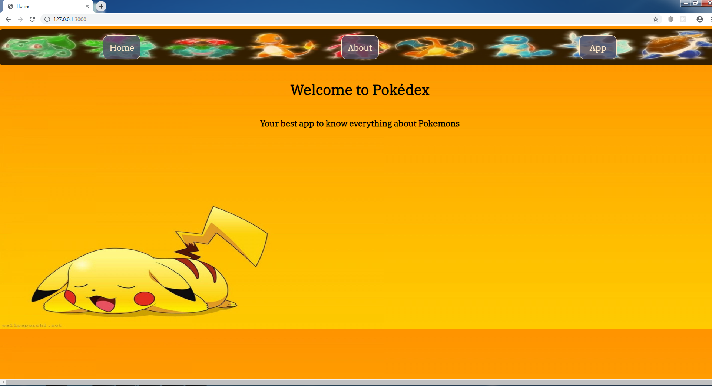
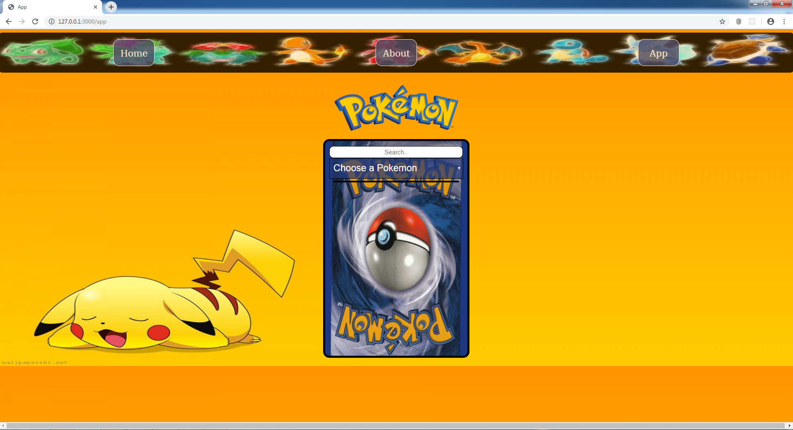
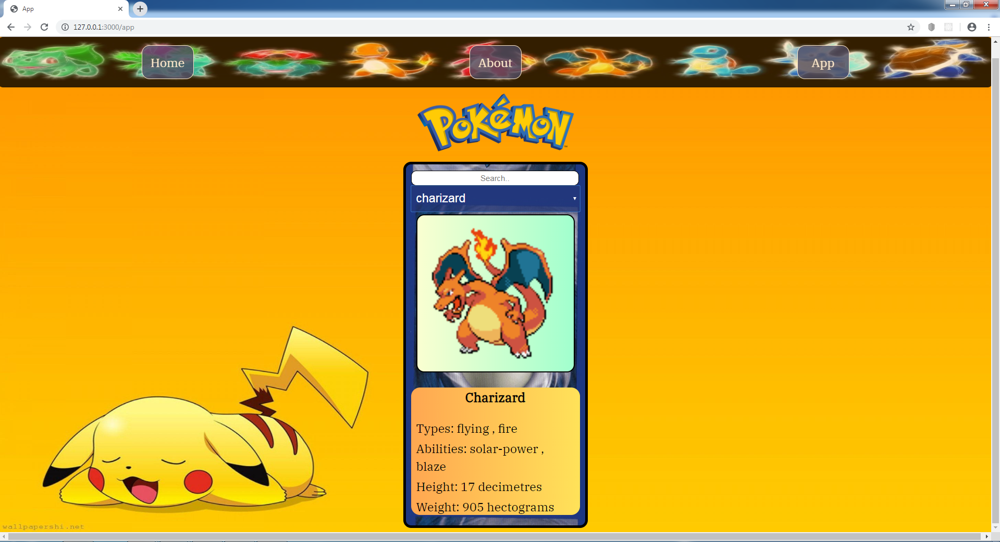

# &lt;/salt&gt;

## Individual hack day!

This project was created at SALT as a "hack day", a full stack project in one day

## Tech stack:
- node.js
- express
- handlebars

## About the project:
the app has 3 routes: 
    - Home
    - About
    - App

- When navigating into the App route, you will fetch all the pokemon names from PokeApi(+900 pokemon name) and you will see them when you press the drop down button.
- There is also a search functionality to search for a specific pokemon.
- Choosing a pokemon will fetch the image and the related info about that specific pokemon.

Screenshots:

